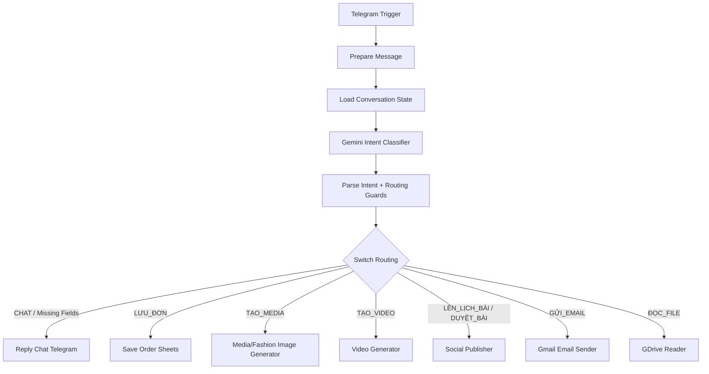

# Workflow 01: Telegram Gateway (Cổng giao tiếp điều khiển)

## 1. Tổng quan (Overview)
Workflow `01_Telegram_Gateway` đóng vai trò là cổng tiếp nhận yêu cầu trung tâm của hệ thống tự động hóa. Khi quản trị viên gửi tin nhắn đến Telegram Bot, tin nhắn sẽ được phân tích ý định (Intent Classification) bằng AI để điều hướng đến các tác vụ tự động tương ứng:
- **LƯU_ĐƠN**: Lưu thông tin đơn hàng của khách hàng vào Google Sheets.
- **TẠO_MEDIA**: Gọi workflow con tạo hình ảnh và video AI phục vụ marketing.
- **TẠO_SHEET**: Tạo một bảng tính Google Sheets mới phục vụ lưu trữ thống kê hàng ngày.
- **LÊN_LỊCH_BÀI**: Gửi nội dung bài đăng sang workflow social publisher để tạo mã duyệt và lịch đăng Facebook/TikTok.
- **DUYỆT_BÀI**: Duyệt mã bài đang chờ để workflow social publisher đăng/lên lịch.
- **GỬI_EMAIL**: Gọi workflow gửi email bằng Gmail.
- **TẠO_VIDEO**: Gọi workflow tạo video AI từ ảnh sản phẩm.
- **ĐỌC_FILE**: Gọi workflow tìm và đọc file từ Google Drive.
- **CHAT**: Trả lời hội thoại thông thường với quản trị viên.

---

## 2. Cơ chế kích hoạt (Trigger)
*   **Node sử dụng:** `Telegram Trigger` (loại: `n8n-nodes-base.telegramTrigger`).
*   **Sự kiện lắng nghe:** `message` (lắng nghe mọi tin nhắn văn bản gửi tới bot).
*   **Tài khoản kết nối (Credentials):** Sử dụng `Telegram Bot Token` (`temp-creds-tele`).

---

## 3. Cấu trúc luồng xử lý (Data Flow)

### Chi tiết các Node xử lý:

#### A. Prepare Message
*   **Loại node:** Code (`n8n-nodes-base.code`).
*   **Chức năng:** Chuẩn hóa Telegram message, giữ nguyên text/caption người dùng gửi và chỉ bổ sung metadata ảnh (`photo_file_id`, `photo_caption`, `message_kind`). Node này không còn tự biến mọi ảnh thành lệnh tạo ảnh AI.

#### B. Load Conversation State
*   **Loại node:** Code (`n8n-nodes-base.code`).
*   **Chức năng:** Đọc trạng thái hội thoại ngắn hạn theo `chat_id` từ `getWorkflowStaticData('global')`, loại bỏ session hết hạn, và gắn workflow catalog rút gọn vào payload cho Gemini.
*   **Session dùng cho các tác vụ nhiều bước:** Ví dụ khi user nói "Đăng bài lên fanpage", workflow lưu `active_intent=LÊN_LỊCH_BÀI` và `missing_fields=["content","publish_at"]`. Tin nhắn ảnh/caption tiếp theo được hiểu là dữ liệu bài đăng thay vì yêu cầu tạo ảnh AI.

#### C. Gemini Intent Classifier
*   **Loại node:** HTTP Request gọi Gemini (`gemini-3.1-flash-lite:generateContent`).
*   **Input ngữ cảnh:** Tin nhắn hiện tại, session state, workflow catalog và routing rules.
*   **Output JSON:** `intent`, `confidence`, `reason`, `params`, `missing_fields`, `state_update`.
*   **Workflow catalog nguồn:** [`config/workflow-capabilities.json`](../../config/workflow-capabilities.json) là bản mô tả đầy đủ để bảo trì; trong node WF01 dùng bản rút gọn nhằm giữ prompt ngắn và ổn định.

#### D. Parse Intent + Routing Guards
*   **Loại node:** Code (`n8n-nodes-base.code` - Javascript).
*   **Chức năng:** Parse JSON từ Gemini, inject metadata Telegram, áp dụng deterministic guards, và cập nhật/xóa session state.
*   **Guard quan trọng:**
    * Nếu đang chờ `LÊN_LỊCH_BÀI`, ảnh/caption kế tiếp là ảnh/nội dung bài đăng.
    * Không route `TẠO_MEDIA` chỉ vì message có ảnh; phải có yêu cầu tạo/sinh/thiết kế ảnh rõ ràng.
    * Nếu thiếu required fields, trả về `CHAT` để hỏi tiếp và lưu `state_update`.

#### E. Switch Routing
*   **Loại node:** Switch (`n8n-nodes-base.switch`).
*   **Thuộc tính kiểm tra:** `={{ $json.intent }}`.
*   **Điều hướng:**
    *   **Nhánh 0 (CHAT - mặc định):** Gửi phản hồi văn bản về Telegram thông qua node `Reply Chat Telegram`.
    *   **Nhánh 1 (LƯU_ĐƠN):** Ghi thông tin khách hàng được trích xuất (Tên, SĐT, Địa chỉ, Sản phẩm) vào Google Sheets thông qua node `Save Order Sheets`.
    *   **Nhánh 2 (TẠO_MEDIA):** Gọi bất đồng bộ (không chờ kết quả) sang Workflow `04_Media_Generator` để sinh ảnh/video qua node `Call Media Generator`.
    *   **Nhánh 3 (TẠO_SHEET):** Khởi tạo một bảng tính Google Sheets mới qua node `Create Daily Sheets`.
    *   **Nhánh 4/5 (LÊN_LỊCH_BÀI/DUYỆT_BÀI):** Gọi Workflow `06_Social_Publisher` để tạo mã duyệt hoặc thực thi đăng/lên lịch.
    *   **Nhánh 6 (GỬI_EMAIL):** Gọi Workflow `08_Gmail_Email_Sender`.
    *   **Nhánh 7 (TẠO_VIDEO):** Gọi Workflow `09_Video_Generator`.
    *   **Nhánh 8 (ĐỌC_FILE):** Gọi Workflow `10_Telegram_GDrive_Reader`.

---

## 4. Các Node đầu ra & Tác vụ kết nối (Outputs)

### 1. Reply Chat Telegram (Tác vụ Chat thường)
*   **Loại node:** Telegram (`n8n-nodes-base.telegram`).
*   **Nội dung:** Gửi phản hồi văn bản `={{ $json.params.reply || "Tôi có thể giúp gì cho bạn?" }}` về ID chat ban đầu (`={{ $node["Telegram Trigger"].json.message.chat.id }}`).

### 2. Save Order Sheets (Tác vụ lưu đơn hàng)
*   **Loại node:** Google Sheets (`n8n-nodes-base.googleSheets`).
*   **Hành động:** Append (Thêm hàng mới).
*   **Các trường dữ liệu được ghi:**
    *   `Tên Khách Hàng`: `={{ $json.params.customer_name }}`
    *   `Số Điện Thoại`: `={{ $json.params.phone }}`
    *   `Địa Chỉ`: `={{ $json.params.address }}`
    *   `Sản Phẩm`: `={{ $json.params.product }}`

### 3. Call Media Generator (Tác vụ sinh ảnh/video)
*   **Loại node:** Execute Workflow (`n8n-nodes-base.executeWorkflow`).
*   **Workflow gọi:** `04_Media_Generator`.
*   **Cấu hình:** `Wait For Results = false` (Chạy ngầm bất đồng bộ, phản hồi nhanh cho Telegram Gateway).

### 4. Create Daily Sheets (Tác vụ tạo bảng tính mới)
*   **Loại node:** Google Sheets (`n8n-nodes-base.googleSheets`).
*   **Hành động:** Create (Tạo file bảng tính mới).
*   **Tiêu đề file:** `=Thống Kê Khách Hàng - {{ DateTime.now().toFormat('yyyy-MM-dd') }}`.

### 5. Call Social Publisher (Tác vụ đăng/lên lịch)
*   **Loại node:** Execute Workflow (`n8n-nodes-base.executeWorkflow`).
*   **Workflow gọi:** `06_Social_Publisher`.
*   **Mục tiêu:** Tạo mã duyệt bài qua Telegram, sau khi duyệt thì chờ tới `publish_at` và đăng/lên lịch Facebook/TikTok.

### 6. Session State (Tác vụ nhiều bước)
*   **Storage:** `getWorkflowStaticData('global').telegramSessions`.
*   **TTL:** 30 phút cho mỗi chat.
*   **Dữ liệu lưu:** `active_intent`, `status`, `collected`, `missing_fields`, `last_bot_question`, `updated_at`, `expires_at`.
*   **Ví dụ:** User gửi "Đăng bài lên fanpage" -> workflow hỏi nội dung/ảnh/thời gian và lưu pending state. User gửi ảnh kèm `Nội dung: Hello world` -> workflow giữ intent đăng bài, lưu ảnh+nội dung, hỏi tiếp thời gian đăng.

---

## 5. Lưu ý & Bảo trì (Operational Notes)
*   **Đảm bảo Token hoạt động:** Hãy chắc chắn cấu hình đúng Telegram Bot Token tại phần Credential `temp-creds-tele`.
*   **Quyền truy cập Google Sheets:** Đảm bảo kết nối Google Sheets OAuth2 API (`temp-creds-sheets`) đã được xác thực thành công và có quyền ghi vào thư mục Google Drive của bạn.
*   **Độ ổn định của AI Router:** Gemini chỉ là lớp suy luận. `Parse Intent + Routing Guards` là lớp quyết định cuối để bảo vệ các luồng nhiều bước và tránh nhầm ảnh đăng bài thành yêu cầu tạo ảnh AI.
*   **Bảo trì workflow catalog:** Khi thêm workflow mới, cập nhật cả `config/workflow-capabilities.json` và bản catalog rút gọn trong node `Load Conversation State`.
