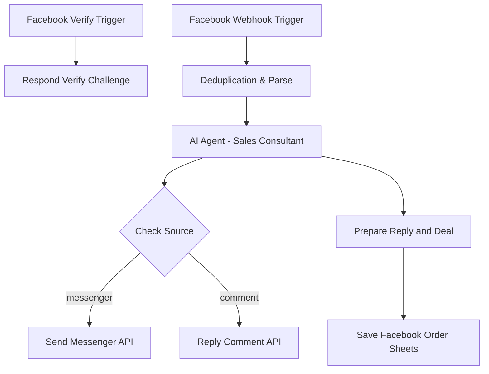

# Workflow 02: Facebook Fanpage Gateway (Tự động tư vấn & Chốt deal)

## 1. Tổng quan (Overview)
Workflow `02_Facebook_Gateway` thiết lập một cổng tích hợp Webhook với Facebook Fanpage. Workflow có nhánh `GET` để xác minh Meta webhook bằng `hub.challenge` và nhánh `POST` để theo dõi/xử lý hai sự kiện chính từ người dùng:
1.  **Tin nhắn Messenger mới** gửi tới Fanpage.
2.  **Bình luận mới (Comments)** trên các bài đăng của Fanpage.

Hệ thống sử dụng mô hình trí tuệ nhân tạo **Gemini 3.5 Flash** kết hợp bộ nhớ hội thoại để tự động phản hồi khách hàng theo kịch bản bán hàng thời trang cao cấp một cách nhanh chóng, thân thiện.

---

## 2. Cơ chế kích hoạt (Trigger)
*   **Node sử dụng:** `Facebook Webhook Trigger` (loại: `n8n-nodes-base.webhook`).
*   **Phương thức:** HTTP `GET` cho verification và HTTP `POST` cho event runtime.
*   **Đường dẫn webhook:** `fb-webhook`.
*   **Mô tả:** URL Webhook này cần được cấu hình trong bảng điều khiển nhà phát triển của Meta (Facebook Developer App) với quyền lắng nghe các sự kiện `messages` và `feed` (bình luận).

---

## 3. Cấu trúc luồng xử lý (Data Flow)



### Chi tiết các Node xử lý:

#### A. Deduplication & Parse (Lọc trùng & Phân tích)
*   **Loại node:** Code (`n8n-nodes-base.code` - Javascript).
*   **Vai trò:** 
    *   **Lọc trùng tin nhắn:** Do cơ chế của Meta Webhook có thể gửi lại một payload nhiều lần nếu không nhận được phản hồi HTTP 200 kịp thời, node này sử dụng static data của n8n (`getWorkflowStaticData('global')`) để lưu danh sách ID của tin nhắn/bình luận đã xử lý. Nó lưu tối đa 200 ID gần nhất và tự động dọn dẹp (cắt về 100 ID cũ nhất) để tối ưu hóa bộ nhớ.
    *   **Chuẩn hóa dữ liệu đầu vào:** Phân tích cấu trúc JSON của Facebook trả về để xác định nguồn đến là tin nhắn Messenger (`source: "messenger"`) hay bình luận (`source: "comment"`), đồng thời trích xuất các thông tin cần thiết: nội dung tin nhắn (`text`), ID người gửi (`senderId`), và ID phản hồi tương ứng (`msgId` hoặc `commentId`).

#### A0. Facebook Verify Trigger
*   **Loại node:** Webhook GET cùng path `fb-webhook`.
*   **Vai trò:** So sánh `hub.verify_token` với `FACEBOOK_WEBHOOK_VERIFY_TOKEN` và trả raw `hub.challenge` dạng `text/plain` nếu hợp lệ.

#### B. AI Agent (Sales Consultant)
*   **Loại node:** Agent (`@n8n/n8n-nodes-langchain.agent`) kết hợp mô hình chat Gemini 3.5 Flash.
*   **Bộ nhớ hội thoại:** Tích hợp `Window Buffer Memory` (lưu trữ lịch sử hội thoại 10 câu gần nhất để trả lời có ngữ cảnh, tránh việc AI trả lời rời rạc).
*   **Cấu hình Prompt:**
    *   *System Message:* "Bạn là nhân viên tư vấn bán hàng của Fanpage. Trả lời thân thiện, ngắn gọn, xúc tích bằng tiếng Việt. Hãy tư vấn về các mẫu váy thời trang cao cấp của cửa hàng."
    *   *Prompt chính:*
        ```text
        Khách hàng nhắn tin: "{{ $json.text }}". Hãy trả lời tư vấn cho khách hàng dựa trên kịch bản bán hàng và thông tin sản phẩm.
        ```

#### C. Check Source
*   **Loại node:** Switch (`n8n-nodes-base.switch`).
*   **Thuộc tính kiểm tra:** `={{ $json.source }}`.
*   **Điều hướng:**
    *   Nếu nguồn là `messenger` -> chuyển tiếp tới node `Send Messenger API`.
    *   Nếu nguồn là `comment` -> chuyển tiếp tới node `Reply Comment API`.

#### D. Prepare Reply and Deal
*   **Loại node:** Code.
*   **Vai trò:** Chuẩn hóa câu trả lời từ AI, phát hiện tín hiệu chốt/mua/đặt hàng hoặc số điện thoại/địa chỉ, rồi gửi thông tin sang Google Sheets.

---

## 4. Các Node đầu ra & Tác vụ kết nối (Outputs)

### 1. Send Messenger API (Gửi tin nhắn Messenger)
*   **Loại node:** HTTP Request (`n8n-nodes-base.httpRequest`).
*   **Phương thức:** `POST`.
*   **URL:** `https://graph.facebook.com/v19.0/me/messages`.
*   **Tham số truy vấn (Query Parameters):** `access_token` lấy từ `FACEBOOK_PAGE_ACCESS_TOKEN`.
*   **Dữ liệu gửi đi (JSON Body):**
    ```json
    {
      "recipient": {
        "id": "{{ $node["Deduplication & Parse"].json.senderId }}"
      },
      "message": {
        "text": "{{ $json.output }}"
      }
    }
    ```

### 2. Reply Comment API (Trả lời bình luận)
*   **Loại node:** HTTP Request (`n8n-nodes-base.httpRequest`).
*   **Phương thức:** `POST`.
*   **URL:** `https://graph.facebook.com/v19.0/{{ $node["Deduplication & Parse"].json.commentId }}/comments`.
*   **Tham số truy vấn (Query Parameters):** `access_token` lấy từ `FACEBOOK_PAGE_ACCESS_TOKEN`.
*   **Dữ liệu gửi đi (JSON Body):**
    ```json
    {
      "message": "{{ $json.output }}"
    }
    ```

---

## 5. Lưu ý & Bảo trì (Operational Notes)
*   **Token:** Hãy chắc chắn cấu hình Page Access Token hợp lệ trong biến `FACEBOOK_PAGE_ACCESS_TOKEN`.
*   **Biến môi trường:** Workflow hiện dùng `FACEBOOK_WEBHOOK_VERIFY_TOKEN`, `FACEBOOK_PAGE_ACCESS_TOKEN`, `GOOGLE_SHEETS_DOCUMENT_ID`, `GOOGLE_ORDERS_SHEET_NAME`.
*   **Lọc trùng tin nhắn:** Cơ chế static data chạy bằng hàm `getWorkflowStaticData` yêu cầu workflow phải được chạy chính thức (Active) trên n8n để dữ liệu tĩnh được lưu trữ lâu dài giữa các phiên chạy độc lập. Khi chạy thử nghiệm (Test run) thủ công trên canvas, danh sách ID trùng lặp có thể không được bảo lưu hoàn toàn.
*   **Lưu ý về phiên bản Graph API:** Endpoint sử dụng API Graph v19.0. Tùy thuộc vào thời điểm vận hành, bạn có thể cập nhật phiên bản API này lên bản mới nhất (ví dụ: v20.0, v21.0...) nếu Facebook yêu cầu.
