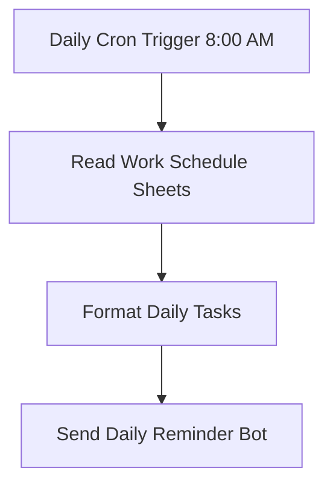

# Workflow 03: Task Scheduler (Nhắc nhở công việc hàng ngày)

## 1. Tổng quan (Overview)
Workflow `03_Task_Scheduler` tự động hóa việc theo dõi công việc hàng ngày từ Google Sheets. Vào lúc 8:00 sáng mỗi ngày, hệ thống sẽ tự động quét danh sách kế hoạch, lọc ra các nhiệm vụ trong ngày chưa hoàn thành, định dạng thành tin nhắn Markdown trực quan và gửi trực tiếp đến Telegram của quản trị viên để nhắc nhở công việc.

---

## 2. Cơ chế kích hoạt (Trigger)
*   **Node sử dụng:** `Daily Cron Trigger (8:00 AM)` (loại: `n8n-nodes-base.scheduleTrigger`).
*   **Cấu hình:** Sử dụng quy tắc lập lịch biểu (Cron Expression) `0 8 * * *` giúp hệ thống tự động chạy vào lúc 8h sáng hàng ngày (theo múi giờ cấu hình của server n8n).

---

## 3. Cấu trúc luồng xử lý (Data Flow)

### Chi tiết các Node xử lý:

#### A. Read Work Schedule Sheets (Đọc bảng biểu)
*   **Loại node:** Google Sheets (`n8n-nodes-base.googleSheets`).
*   **Tài khoản kết nối (Credentials):** Sử dụng Google Sheets API (`temp-creds-sheets`).
*   **Hành động:** Đọc dữ liệu từ file Google Sheets chứa lịch trình làm việc.
*   **Đầu ra:** Trả về một mảng chứa thông tin của tất cả các dòng dữ liệu trong bảng tính.

#### B. Format Daily Tasks (Lọc & Định dạng dữ liệu)
*   **Loại node:** Code (`n8n-nodes-base.code` - Javascript).
*   **Thuật toán xử lý:**
    1.  Lấy ngày hôm nay dưới định dạng `yyyy-MM-dd` bằng thư viện `Luxon` có sẵn trong n8n (`DateTime.now()`).
    2.  Lọc mảng công việc đầu vào: tìm các bản ghi có giá trị cột `Ngày` bằng ngày hôm nay và cột `Trạng thái` khác `"Hoàn thành"`.
    3.  **Trường hợp không có công việc nào chưa hoàn thành:** Trả về thông báo khích lệ: `"🎉 Tuyệt vời! Bạn không có công việc tồn đọng nào cho ngày hôm nay."`
    4.  **Trường hợp có công việc cần xử lý:** Ghép các chuỗi thông tin bao gồm cột `Giờ` (nếu trống sẽ mặc định là `"Cả ngày"`) và cột `Nội dung` (nếu trống sẽ mặc định là `"Không có mô tả"`) thành một chuỗi văn bản định dạng Markdown.
*   **Đầu ra:** Trả về đối tượng JSON chứa thông điệp văn bản ở trường `message`.

#### C. Send Daily Reminder Bot (Gửi tin nhắn Telegram)
*   **Loại node:** Telegram (`n8n-nodes-base.telegram`).
*   **Tài khoản kết nối (Credentials):** Sử dụng Telegram Bot Token (`temp-creds-tele`).
*   **ID nhận tin:** lấy từ biến môi trường `ADMIN_TELEGRAM_CHAT_ID`.
*   **Nội dung tin nhắn:** Lấy từ giá trị đầu ra của node trước (`={{ $json.message }}`).
*   **Cài đặt bổ sung:** Thiết lập **Parse Mode** là `Markdown` để hiển thị chữ in đậm, biểu tượng và định dạng chữ nghiêng chuẩn xác.

---

## 4. Cấu trúc bảng tính Google Sheets yêu cầu
Để workflow chạy chính xác, bảng tính Google Sheets của bạn cần có các cột tiêu đề (Headers) sau ở hàng số 1:
| Ngày | Giờ | Nội dung | Trạng thái |
| :--- | :--- | :--- | :--- |
| `yyyy-MM-dd` | `HH:mm` | Tên công việc | Chưa bắt đầu / Đang làm / Hoàn thành |

*Ví dụ hàng dữ liệu chuẩn:*
*   **Ngày:** `2026-06-03`
*   **Giờ:** `09:30`
*   **Nội dung:** `Đăng bài viết mới lên Facebook Fanpage`
*   **Trạng thái:** `Đang làm`

---

## 5. Lưu ý & Bảo trì (Operational Notes)
*   **Định dạng ngày tháng:** Ngày ghi trên Google Sheets phải có định dạng chuỗi chuẩn `yyyy-MM-dd` (ví dụ: `2026-06-03`) để JavaScript so sánh chính xác với ngày hệ thống.
*   **Cấu hình Chat ID Quản trị viên:** Bạn cần điền cụ thể ID Telegram của mình vào ô `Chat ID` trong node `Send Daily Reminder Bot`. Nếu chưa biết Chat ID của mình, bạn có thể chat với bot `@userinfobot` trên Telegram để lấy ID tài khoản cá nhân.
