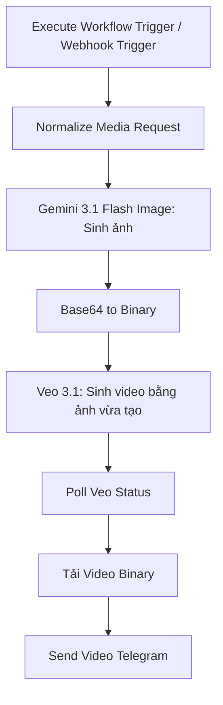

# Workflow 04: Media AI Generator (Xử lý sinh Ảnh/Video từ Google AI Studio)

## 1. Tổng quan (Overview)
Workflow `04_Media_Generator` là một quy trình kỹ thuật cao cấp chuyên xử lý các tác vụ đồ họa và video thế hệ mới. Workflow này kết nối trực tiếp với **Google AI Studio** để:
1.  **Sinh hình ảnh tĩnh chất lượng cao** thông qua mô hình **Gemini 3.1 Flash Image** (Imagen 3).
2.  **Chuyển đổi chuỗi Base64** của ảnh tĩnh thành tệp ảnh nhị phân trực tiếp trên bộ nhớ n8n.
3.  **Tạo video chuyển động ngắn 10 giây** (tỷ lệ 9:16 chuẩn Reels/TikTok) dựa trên mô hình **Veo 3.1 Generate Preview**.
4.  **Tự động kiểm tra trạng thái (Polling)** của tiến trình xử lý video ngầm (Long Running Operation - LRO) và trả tệp tin video gốc về cho người dùng qua Telegram.

---

## 2. Cơ chế kích hoạt (Trigger)
*   **Node sử dụng:** `Execute Workflow Trigger` để nhận dữ liệu từ Telegram Gateway và `Webhook Trigger` HTTP `POST` path `media-trigger` để test/gọi ngoài.
*   **Tham số đầu vào (Payload):**
    *   `prompt`: Câu lệnh mô tả bức ảnh muốn tạo.
    *   `chat_id`: Chat ID của người dùng Telegram để gửi trả kết quả.

---

## 3. Cấu trúc luồng xử lý (Data Flow)



### Chi tiết các Node xử lý:

#### A. Gemini 3.1 Flash Image: Sinh ảnh
*   **Loại node:** HTTP Request (`n8n-nodes-base.httpRequest`).
*   **Endpoint:** `POST https://generativelanguage.googleapis.com/v1/models/gemini-3.1-flash-image:generateContent`.
*   **Payload gửi đi:**
    ```json
    {
      "contents": [
        {
          "role": "user",
          "parts": [{"text": "{{ $json.prompt }}"}]
        }
      ],
      "generationConfig": {
        "responseModalities": ["Image"],
        "responseFormat": {
          "image": {
            "aspectRatio": "9:16",
            "imageSize": "1K"
          }
        }
      }
    }
    ```
*   **Đầu ra:** Nhận phản hồi JSON chứa hình ảnh dạng Base64 trong `candidates[0].content.parts[].inlineData.data`.

#### B. Base64 to Binary
*   **Loại node:** Code (`n8n-nodes-base.code` - Javascript).
*   **Vai trò:** Chuyển đổi dữ liệu ảnh Base64 từ API thành đối tượng nhị phân (Binary property) dạng file tên `image.jpg` và mimeType `image/jpeg` trực tiếp trong luồng dữ liệu của n8n để phục vụ các thao tác tiếp theo.

#### C. Veo 3.1: Sinh video
*   **Loại node:** HTTP Request (`n8n-nodes-base.httpRequest`).
*   **Endpoint:** `POST https://generativelanguage.googleapis.com/v1beta/models/veo-3.1-generate-preview:predictLongRunning` với `GEMINI_API_KEY`.
*   **Mục tiêu:** Khởi tạo một tiến trình sinh video bất đồng bộ (Long Running Operation).
*   **Payload gửi đi:** gồm prompt video và ảnh Base64 vừa tạo để đáp ứng yêu cầu video theo ảnh.
    ```json
    {
      "instances": [
        {
          "prompt": "{{ $json.video_prompt }}",
          "image": {
            "bytesBase64Encoded": "{{ $json.image_base64 }}",
            "mimeType": "{{ $json.image_mime_type }}"
          }
        }
      ],
      "parameters": {
        "aspectRatio": "9:16",
        "durationSeconds": 10,
        "sampleCount": 1
      }
    }
    ```
*   **Đầu ra:** Nhận về một đối tượng Operation chứa tên định danh tiến trình xử lý, ví dụ: `{"name": "operations/abc123xyz"}`.

#### D. Poll Veo Status (Thăm dò trạng thái bất đồng bộ)
*   **Loại node:** Code (`n8n-nodes-base.code` - Javascript).
*   **Thuật toán Polling an toàn:**
    1.  Nhận `operationName` từ Veo API.
    2.  Chạy một vòng lặp tối đa 15 lần.
    3.  Tại mỗi lần lặp, tạm dừng thực thi **15 giây** (`await new Promise(...)`).
    4.  Gọi yêu cầu HTTP `GET` đến operation endpoint với `GEMINI_API_KEY` sử dụng hàm nội bộ `$helpers.httpRequest`.
    5.  Nếu kết quả phản hồi có trường `done === true`:
        *   Nếu có lỗi (`response.error`), ném ra ngoại lệ thông báo lỗi.
        *   Nếu thành công, trích xuất URL video đã tạo từ `response.response.generatedVideos[0].video.uri` và dừng vòng lặp ngay lập tức.
    6.  Nếu sau 15 lần kiểm tra (tương đương 225 giây ~ 3.75 phút) tiến trình vẫn chưa xong, ném lỗi Timeout.

#### E. Tải Video Binary
*   **Loại node:** HTTP Request (`n8n-nodes-base.httpRequest`).
*   **Vai trò:** Gửi yêu cầu tải file video từ đường dẫn URI kết quả thu được ở bước trên.
*   **Cài đặt:** Đặt **Response Format** là `file` để n8n giữ dữ liệu dưới dạng nhị phân.

#### F. Send Video Telegram
*   **Loại node:** Telegram (`n8n-nodes-base.telegram`).
*   **Hành động:** Gửi tài liệu/video gốc (`Send Document/Video`).
*   **Dữ liệu gửi:** Binary property `data` (file video thực tế vừa tải về).
*   **ID nhận tin:** lấy từ dữ liệu đã normalize (`chat_id`) từ Telegram Gateway hoặc webhook payload.
*   **Chú thích (Caption):** `"🎉 Video của bạn đã tạo thành công bằng Google Veo 3.1!"`.

---

## 4. Lưu ý quan trọng khi vận hành (Operational Notes)
*   **Cấu hình API Key:** đặt `GEMINI_API_KEY` trong `.env.local` hoặc credential/runtime env trước khi activate workflow.
*   **Tài khoản Google AI Studio Paid Tier:** Các mô hình tạo video phức tạp như Veo 3.1 thường yêu cầu API Key nằm trong tài khoản đã liên kết thẻ thanh toán quốc tế (Paid Tier). Ở tài khoản miễn phí (Free Tier), bạn có thể gặp lỗi giới hạn lượt gọi (Rate Limit) hoặc không được cấp quyền sử dụng model này.
*   **Timeout vận hành:** Thời gian tạo video của mô hình Veo 3.1 thường dao động từ 1 đến 3 phút. Cơ chế kiểm tra 15 lần x 15s = 225s là cấu hình tối ưu để đảm bảo thành công mà không gây treo tiến trình n8n quá lâu.
