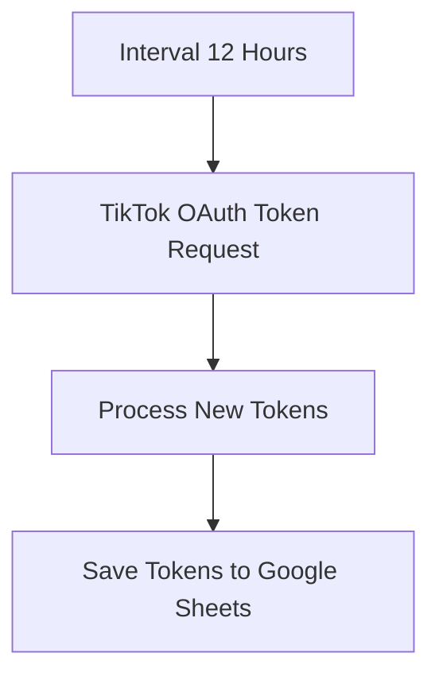

# Workflow 05: TikTok Token Refresher (Bảo trì kết nối TikTok)

## 1. Tổng quan (Overview)
Workflow `05_TikTok_Token_Refresher` chịu trách nhiệm duy trì tính liên tục của kết nối bảo mật OAuth2 với API của TikTok. Do các Access Token của TikTok có thời hạn sử dụng ngắn và Refresh Token cũng hết hạn sau một khoảng thời gian nhất định, workflow này chạy hoàn toàn tự động ở chế độ nền để cập nhật token mới và lưu lại vào Google Sheets. Việc này giúp các tác vụ tự động đăng video/Reels lên TikTok không bị gián đoạn do lỗi hết hạn token (Expired Token).

---

## 2. Cơ chế kích hoạt (Trigger)
*   **Node sử dụng:** `Interval (12 Hours)` (loại: `n8n-nodes-base.intervalTrigger`).
*   **Cài đặt:** Thiết lập chạy định kỳ mỗi **12 giờ** một lần. Khoảng thời gian này giúp đảm bảo token luôn được làm mới trước khi hết hạn (thời hạn sống của Access Token TikTok thường là 24 giờ).

---

## 3. Cấu trúc luồng xử lý (Data Flow)

### Chi tiết các Node xử lý:

#### A. TikTok OAuth Token Request (Gửi yêu cầu làm mới)
*   **Loại node:** HTTP Request (`n8n-nodes-base.httpRequest`).
*   **Phương thức:** `POST`.
*   **URL:** `https://open.tiktokapis.com/v2/oauth/token/`.
*   **Kiểu dữ liệu gửi đi (Headers):** `Content-Type: application/x-www-form-urlencoded`.
*   **Nội dung Form (Body Parameters):**
    *   `client_key`: lấy từ biến `TIKTOK_CLIENT_KEY`.
    *   `client_secret`: lấy từ biến `TIKTOK_CLIENT_SECRET`.
    *   `grant_type`: `refresh_token`.
    *   `refresh_token`: lấy từ biến `TIKTOK_REFRESH_TOKEN`.

#### B. Process New Tokens (Xử lý kết quả)
*   **Loại node:** Code (`n8n-nodes-base.code` - Javascript).
*   **Hành vi:**
    1.  Nhận phản hồi từ TikTok OAuth API.
    2.  **Trường hợp lỗi:** Nếu phản hồi chứa thuộc tính `error` hoặc không có `access_token`, trả về JSON báo lỗi và dừng luồng.
    3.  **Trường hợp thành công:** Trích xuất các trường thông tin: `access_token`, `refresh_token`, `expires_in` (thời gian hết hạn) và ghi dấu thời gian làm mới `refreshed_at` theo chuẩn ISO.
*   **Đầu ra:** Trả về đối tượng JSON chứa thông tin token mới chuẩn bị ghi đè vào Sheets.

#### C. Save Tokens to Google Sheets (Lưu trữ token)
*   **Loại node:** Google Sheets (`n8n-nodes-base.googleSheets`).
*   **Hành động:** Update (Cập nhật dòng dữ liệu đã tồn tại).
*   **Tài khoản kết nối (Credentials):** Sử dụng Google Sheets API (`temp-creds-sheets`).
*   **Khóa tìm kiếm dòng cập nhật (Update Key):** Cột `Key`.
*   **Các cột dữ liệu được ghi đè:**
    *   `Key`: Khớp với giá trị `"tiktok_credentials"` để xác định đúng hàng lưu trữ.
    *   `AccessToken`: `={{ $json.access_token }}` (Ghi đè Access Token mới).
    *   `RefreshToken`: `={{ $json.refresh_token }}` (Ghi đè Refresh Token mới để phục vụ lần làm mới kế tiếp).
    *   `LastUpdated`: `={{ $json.refreshed_at }}` (Ghi nhận thời gian cập nhật).

---

## 4. Cấu trúc bảng tính Google Sheets yêu cầu
Để lưu trữ token thành công, bảng tính Google Sheets cấu hình cần có ít nhất một sheet chứa các cột tiêu đề ở hàng 1 và hàng dữ liệu ban đầu khớp khóa:
| Key | AccessToken | RefreshToken | LastUpdated |
| :--- | :--- | :--- | :--- |
| `tiktok_credentials` | *(Tự động điền)* | *(Mã refresh token ban đầu của bạn)* | *(Tự động điền)* |

---

## 5. Lưu ý & Bảo trì (Operational Notes)
*   **Cấu hình lần đầu:** Bạn cần lấy mã `Refresh Token` thủ công lần đầu tiên sau khi người dùng xác thực ứng dụng (Authorize), sau đó cấu hình `TIKTOK_REFRESH_TOKEN` hoặc ghi trực tiếp vào bảng Google Sheets trước khi kích hoạt chạy tự động.
*   **Ràng buộc tài khoản:** Đảm bảo App TikTok Developer của bạn ở trạng thái Live/Production để token được làm mới trơn tru lâu dài mà không bị khóa hoặc bị thu hồi quyền truy cập.
*   **Bảo mật thông tin:** Client Key và Client Secret là các thông tin nhạy cảm bảo mật. Khuyên dùng các biến môi trường của n8n hoặc hệ thống lưu trữ credential bảo mật thay vì viết cứng trực tiếp vào các trường input nếu deploy dự án lên môi trường dùng chung.
