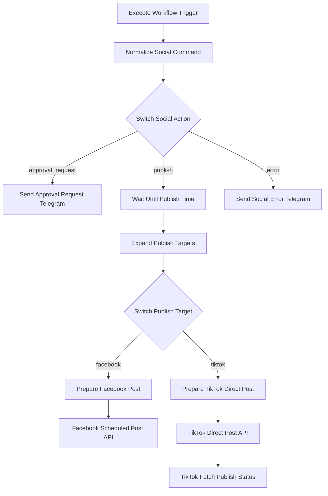

# Workflow 06: Social Publisher (Duyệt, lên lịch và đăng bài)

## 1. Tổng quan
Workflow `06_Social_Publisher` nhận lệnh từ `01_Telegram_Gateway`, tạo mã duyệt bài qua Telegram, chờ tới thời điểm `publish_at` sau khi được duyệt, rồi đăng/lên lịch lên Facebook và TikTok.

Workflow này không triển khai trả lời bình luận TikTok theo phạm vi đã loại trừ.

---

## 2. Luồng xử lý



---

## 3. Cách dùng từ Telegram

### Tạo yêu cầu đăng/lên lịch
Ví dụ:

```text
Lên lịch bài Facebook và TikTok lúc 2026-06-04T09:00:00+07:00:
Caption: Mẫu váy mới về hôm nay.
Video URL: https://example.com/video.mp4
```

Workflow sẽ gửi lại mã duyệt dạng:

```text
Duyệt bài SOC...
```

### Duyệt bài
Gửi lại Telegram:

```text
Duyệt bài SOC...
```

Sau khi duyệt, workflow dùng `Wait Until Publish Time` để chờ tới lịch đăng trước khi gọi API.

---

## 4. Facebook

Workflow tự chọn edge Graph API:
- Có `video_url`: gọi `/{page_id}/videos`.
- Có `image_url`: gọi `/{page_id}/photos`.
- Chỉ có text/caption: gọi `/{page_id}/feed`.

Nếu `publish_at` cách hiện tại hơn 10 phút, workflow thêm:
- `published=false`
- `scheduled_publish_time=<unix timestamp>`

Biến cần cấu hình:
- `FACEBOOK_PAGE_ID`
- `FACEBOOK_PAGE_ACCESS_TOKEN`

---

## 5. TikTok

Workflow dùng TikTok Content Posting API:
- `POST /v2/post/publish/video/init/`
- `POST /v2/post/publish/status/fetch/`

TikTok branch yêu cầu `video_url`. Workflow dùng `source=PULL_FROM_URL`, vì vậy domain chứa video phải được TikTok app xác minh nếu TikTok yêu cầu.

Biến cần cấu hình:
- `TIKTOK_ACCESS_TOKEN`
- Workflow 5 vẫn duy trì token qua `TIKTOK_CLIENT_KEY`, `TIKTOK_CLIENT_SECRET`, `TIKTOK_REFRESH_TOKEN`.

---

## 6. Lưu ý vận hành

Mã duyệt được lưu trong static data của n8n workflow. Static data bền khi workflow chạy active trong n8n production. Nếu import lại workflow hoặc reset dữ liệu n8n, các mã đang chờ duyệt có thể mất.
