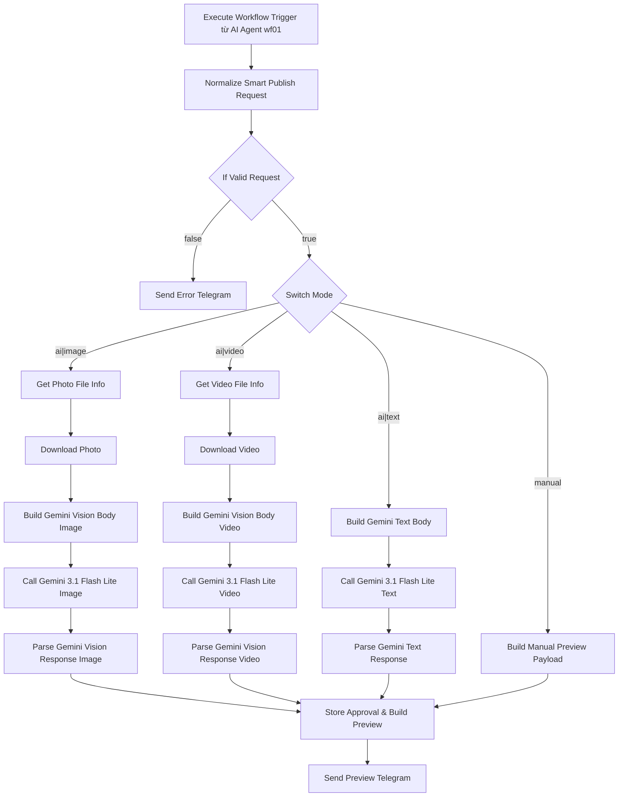

# Workflow 12: Facebook Smart Publisher (AI Content Studio + Auto Publish)

## 1. Tổng quan

Workflow `12_Facebook_Smart_Publisher` là **AI Content Studio** cho Facebook Fanpage. Được AI Agent (wf01) gọi như một sub-workflow tool khi user muốn AI tạo nội dung bài đăng (caption Tiếng Việt) thay vì tự viết. Workflow hỗ trợ 2 mode chính:

- **`mode='ai'`** — Gemini 3.1 Flash Lite phân tích media (ảnh/video) hoặc chủ đề (text) rồi sinh caption Tiếng Việt.
- **`mode='manual'`** — giữ nguyên caption user nhập, không gọi AI.

Sau khi có caption, workflow gửi **preview Telegram** kèm mã duyệt `FSP...`, lưu vào `pending_smart_publish.json`. Khi user reply `Duyệt bài FSP...`, workflow sẽ **gọi lại `wf06_Social_Publisher`** (đã có sẵn) để đăng/lên lịch Facebook.

Workflow này **không tự publish** — luôn chờ user duyệt qua Telegram (best practice cho social media).

---

## 2. Luồng xử lý



Tổng cộng: **22 nodes, 19 connections**.

---

## 3. Input từ AI Agent (wf01)

Workflow nhận JSON input với cấu trúc:

```json
{
  "params": {
    "mode": "ai",
    "media_kind": "image",
    "photo_file_id": "AgACAgIAAxk...",
    "user_prompt": "Bộ sưu tập Tết 2026",
    "user_caption": "",
    "chat_id": "123456789",
    "target_page": "default",
    "platform": "facebook",
    "tone": "friendly",
    "language": "vi"
  }
}
```

| Field | Required | Mô tả |
|---|---|---|
| `mode` | Có | `'ai'` hoặc `'manual'`. Mặc định: `'ai'`. |
| `media_kind` | Khi có media | `'image'` \| `'video'` \| `'text'`. Mặc định: `'text'`. |
| `photo_file_id` | Khi `media_kind=image` | Telegram `file_id` của ảnh (từ metadata Telegram trigger). |
| `video_file_id` | Khi `media_kind=video` | Telegram `file_id` của video. |
| `image_url` | Tùy chọn | URL ảnh công khai (alternative cho `photo_file_id`). |
| `video_url` | Tùy chọn | URL video công khai (alternative cho `video_file_id`). |
| `user_prompt` | Khi `mode=ai` & không có media | Chủ đề/chủ đề để AI viết caption. |
| `user_caption` | Khi `mode=manual` | Caption do user nhập. |
| `chat_id` | Có | Telegram chat_id để gửi preview. |
| `target_page` | Tùy chọn | Page ID mục tiêu. Mặc định: `'default'`. |
| `platform` | Tùy chọn | `'facebook'` \| `'tiktok'` \| `'both'`. Mặc định: `'facebook'`. |
| `tone` | Tùy chọn | `'friendly'` \| `'luxury'` \| `'casual'` \| `'urgent'`. Mặc định: `'friendly'`. |
| `language` | Tùy chọn | `'vi'` \| `'en'`. Mặc định: `'vi'`. |

**Lưu ý validation** (trong `Normalize Smart Publish Request`):

- Nếu `mode=ai` + `media_kind=image` mà **không có** `photo_file_id` lẫn `image_url` → tự động fallback về `text` mode (yêu cầu `user_prompt`).
- Nếu `mode=manual` mà `user_caption` rỗng → trả về lỗi `Thiếu nội dung caption (user_caption) cho chế độ manual.`
- Nếu `mode=ai` (sau fallback) mà `user_prompt` rỗng → trả về lỗi.

---

## 4. Gemini 3.1 Flash Lite call (cố định)

**Endpoint**: `POST https://generativelanguage.googleapis.com/v1beta/models/gemini-3.1-flash-lite:generateContent`

**Auth header**: `x-goog-api-key: {{ $env.GEMINI_API_KEY }}`

**Body cho Vision (ảnh/video)**:
```json
{
  "contents": [{
    "parts": [
      { "text": "<system prompt Tiếng Việt>" },
      { "inlineData": { "mimeType": "image/jpeg", "data": "<base64>" } }
    ]
  }],
  "generationConfig": {
    "responseMimeType": "application/json",
    "responseSchema": {
      "type": "object",
      "properties": {
        "caption":  { "type": "string" },
        "hashtags": { "type": "array", "items": { "type": "string" } },
        "cta":      { "type": "string" },
        "tone":     { "type": "string", "enum": ["friendly", "luxury", "casual", "urgent"] }
      },
      "required": ["caption", "hashtags"]
    }
  }
}
```

**Body cho Text-only**: bỏ `inlineData`, chỉ giữ `parts[0].text`.

**System prompt mẫu (image mode, tiếng Việt, friendly)**:
```
Bạn là copywriter chuyên nghiệp cho fanpage Facebook thời trang Việt Nam.

Nhiệm vụ: Phân tích hình ảnh sản phẩm được đính kèm và viết caption bằng tiếng Việt phù hợp để đăng lên Facebook Fanpage.

Yêu cầu:
- Tone: thân thiện, gần gũi, dùng nhiều emoji
- Caption: 2-4 câu, có cảm xúc, có hook mở đầu thu hút
- Có 1-2 emoji phù hợp (không lạm dụng)
- 3-6 hashtag liên quan (mix tiếng Việt + tiếng Anh nếu phù hợp)
- 1 câu call-to-action rõ ràng (CTA)
Bối cảnh thêm từ người dùng: Bộ sưu tập Tết 2026

Trả về JSON hợp lệ theo schema.
```

**Response parse** (`Parse Gemini Vision Response` / `Parse Gemini Text Response`):
- Check `finishReason === 'SAFETY'` → trả về error.
- Extract `candidates[0].content.parts[].text`.
- `JSON.parse(rawText)`. Nếu fail → fallback dùng `rawText` làm `caption` (không có hashtags/cta).
- Build `fullCaption = caption + "\n\n" + hashtags.map(add#).join(" ") + "\n\n👉 " + cta`.

---

## 5. Telegram Preview & Approval flow

`Store Approval & Build Preview` node:

```js
const approvalId = 'FSP' + Date.now().toString(36).toUpperCase();
// Lưu vào .n8n/pending_smart_publish.json cùng pattern với wf06
```

`Send Preview Telegram` node gửi message:

```
📝 PREVIEW BÀI ĐĂNG FACEBOOK
━━━━━━━━━━━━━━━
🆔 Mã: FSPABC123
🎨 Mode: ai
📎 Media: image

✍️ Nội dung:
<fullCaption>

━━━━━━━━━━━━━━━
✅ Gửi: Duyệt bài FSPABC123 để đăng ngay
✏️ Gửi: Sửa bài FSPABC123 [feedback] để AI viết lại
```

**Sau khi user reply "Duyệt bài FSP..."** (workflow kế tiếp sẽ xử lý trong tương lai):
- TODO (ngoài scope ST-012): Trigger reply handling → gọi `wf06_Social_Publisher` với `action='publish'` và caption đã duyệt.

---

## 6. Test

### Unit tests (23 mới)

| Test suite | Số test | Mô tả |
|---|---|---|
| `WF12 — Normalize Smart Publish Request` | 7 | Validate mode, fallback image→text, manual validation, alias normalization |
| `WF12 — Build Gemini Text Body` | 4 | System prompt có topic + tone + language, responseSchema đúng |
| `WF12 — Parse Gemini Response` | 5 | Valid JSON, fallback raw text, SAFETY, # prefix, empty candidates |
| `WF12 — Build Manual Preview Payload` | 4 | Preserve caption, trim whitespace, empty check, pass-through fields |
| `WF12 — Approval ID generation` | 3 | FSP prefix, error payload → null, unique IDs |

Chạy: `node scripts/unit-tests.mjs` → **143/143 pass** (23 mới + 120 cũ).

### Workflow structure test

`node scripts/test-workflows.mjs` → **0 fail, 61 pass, 45 warn**.

---

## 7. Tích hợp với AI Agent (wf01)

Workflow được AI Agent gọi như một tool LangChain. Trong `01_Telegram_AI_Agent.json`:

**Tool mới** (loại `toolWorkflow`):
```json
{
  "name": "facebook_smart_publisher",
  "workflowId": "wf12facebooksmartpublisher",
  "description": "AI Content Studio cho Facebook Fanpage. Tạo caption Tiếng Việt bằng Gemini 3.1 Flash Lite..."
}
```

**System message updates**:
- Capability: "Tạo caption Facebook bằng AI từ ảnh/video/topic (Tool: facebook_smart_publisher)"
- Rule 3b: "Với tool facebook_smart_publisher: luôn truyền mode='ai' nếu user muốn AI viết, mode='manual' nếu user đã có sẵn caption. Sau khi tool trả preview, mới gọi tiếp social_publisher để đăng."
- Rule 5 update: "Nếu user yêu cầu đăng bài + muốn AI viết caption → gọi facebook_smart_publisher (mode='ai')"

---

## 8. Biến môi trường cần thiết

| Biến | Mô tả |
|---|---|
| `GEMINI_API_KEY` | Google AI Studio API key (đã có sẵn) |
| `TELEGRAM_BOT_TOKEN` | Bot token để resolve file_id + gửi preview |
| `N8N_USER_FOLDER` | Thư mục lưu `pending_smart_publish.json` |
| `ADMIN_TELEGRAM_CHAT_ID` | Fallback chat_id khi user không truyền |

---

## 9. Hạn chế hiện tại & hướng mở rộng

| Hạn chế | Hướng mở rộng |
|---|---|
| Chưa có reply handler cho "Duyệt bài FSP..." | Thêm Telegram trigger + state machine để gọi lại wf06 |
| Chưa gửi ảnh/video kèm preview (chỉ text preview) | Dùng Telegram `sendPhoto`/`sendVideo` dựa trên `photo_file_id`/`video_file_id` |
| Chỉ Facebook (TikTok qua wf06) | Tương lai: thêm `12b_TikTok_Smart_Publisher` với tone TikTok |
| Không có A/B test nhiều caption | Thêm Gemini call thứ 2 sinh 2 phiên bản |
| Gemini Flash Lite giới hạn token ảnh ~5MB | Validate kích thước ảnh trước khi gửi |

---

## 10. Files

- **Workflow JSON**: `workflows/12_Facebook_Smart_Publisher.json`
- **Story**: `docs/stories/ST-012-facebook-smart-publisher.md`
- **Tests**: `scripts/unit-tests.mjs` (23 tests mới trong suites `WF12 — ...`)
- **AI Agent update**: `workflows/01_Telegram_AI_Agent.json` (1 tool mới + system message update)
