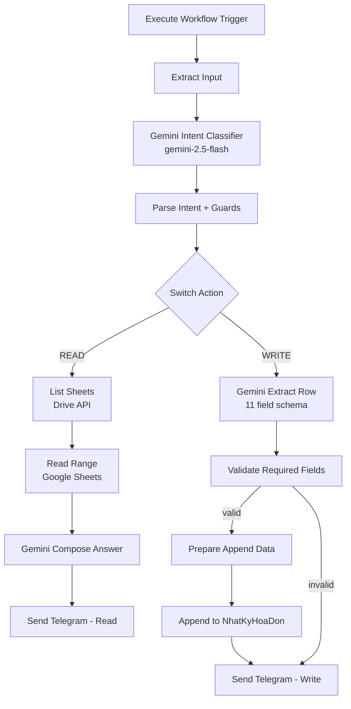

# Workflow 13: NhatKy Hoa Don Assistant (Trợ lý đọc & ghi Google Sheet Nhật ký hóa đơn)

## 1. Tổng quan (Overview)
Sub-workflow `13_NhatKyHoaDon_Assistant` cho phép admin chat với Telegram bot để:
- **ĐỌC** thông tin từ Google Sheet `Nhật ký hóa đơn` (sheet ID mặc định qua env `GOOGLE_SHEETS_DOCUMENT_ID`).
- **GHI** (append) 1 dòng đơn hàng mới vào sheet, AI tự động trích xuất 11 cột từ câu chat tự nhiên tiếng Việt.

Workflow hoạt động như 1 **tool** trong `01_Telegram_AI_Agent` (LangChain AI Agent). AI Agent sẽ tự quyết định gọi tool này khi user hỏi về đơn hàng / khách thuê / sản phẩm VDxx, hoặc yêu cầu thêm đơn mới.

## 2. Trigger
- **Node**: `Execute Workflow Trigger` (`n8n-nodes-base.executeWorkflowTrigger`).
- Được gọi từ `01_Telegram_AI_Agent` qua `toolWorkflow` node với input:
  ```json
  {
    "user_message": "<câu chat của user>",
    "chat_id": "<Telegram chat_id>"
  }
  ```

## 3. Cấu trúc luồng xử lý (Data Flow)



## 4. Chi tiết các Node

### A. Extract Input
- **Loại**: Code (`n8n-nodes-base.code`, v2)
- **Chức năng**: Parse input từ AI Agent, đảm bảo `user_message` và `chat_id` tồn tại. Throw error nếu thiếu `user_message`.

### B. Gemini Intent Classifier
- **Loại**: HTTP Request gọi `gemini-2.5-flash:generateContent`
- **Schema output**:
  ```json
  {
    "action": "READ" | "WRITE",
    "filter": "string (optional)",
    "sheet_name": "string (default: 'Nhật ký hóa đơn')"
  }
  ```
- **Prompt**: Hướng dẫn Gemini phân loại intent + extract filter từ câu user.
- **Fallback**: Nếu parse JSON fail → mặc định `action=READ`.

### C. Parse Intent + Guards
- **Loại**: Code
- **Chức năng**: Parse `candidates[0].content.parts[0].text` thành JSON object, validate `action ∈ {READ, WRITE}`, set defaults.

### D. Switch Action
- **Loại**: Switch (3 outputs: 0=read, 1=write, fallback=error)
- Route tới 2 nhánh:
  - **READ** → List Sheets → Read Range → Compose → Reply
  - **WRITE** → Extract Row → Validate → Append → Reply

### E. Nhánh READ

#### E.1 List Sheets
- **Loại**: HTTP Request
- **Endpoint**: `GET https://sheets.googleapis.com/v4/spreadsheets/{id}?fields=sheets.properties`
- Lấy danh sách tất cả tab trong spreadsheet (để mở rộng multi-tab sau này).

#### E.2 Read Range
- **Loại**: Google Sheets (`n8n-nodes-base.googleSheets`, v4.4)
- **Operation**: read
- **Sheet name**: dynamic từ `Parse Intent` (`Nhật ký hóa đơn` default)
- Đọc range `A1:K100` (đủ cho 100 dòng data).

#### E.3 Gemini Compose Answer
- **Loại**: HTTP Request
- **Model**: `gemini-2.5-flash` (không schema, free-form text)
- **Prompt**: Cho Gemini data JSON + câu hỏi user + filter → yêu cầu trả lời tiếng Việt ngắn gọn, format bảng Markdown nếu có nhiều dòng, không bịa data.

#### E.4 Send Telegram (Read)
- **Loại**: Telegram
- Gửi câu trả lời từ Gemini về `chat_id` với `parse_mode: Markdown`.

### F. Nhánh WRITE

#### F.1 Gemini Extract Row
- **Loại**: HTTP Request
- **Model**: `gemini-2.5-flash`
- **Schema output** (responseSchema):
  ```json
  {
    "so_hoa_don": "string (REQUIRED)",
    "ma_san_pham": "string (REQUIRED)",
    "ten_khach": "string (REQUIRED)",
    "sdt_khach": "string (REQUIRED)",
    "dia_chi": "string (optional)",
    "ngay_thue": "string dd/MM/yyyy (REQUIRED)",
    "ngay_tra": "string dd/MM/yyyy (REQUIRED)",
    "nhan_vien": "string (optional)",
    "hoa_hong": "string (optional)",
    "email_kh": "string (optional)"
  }
  ```
- **Prompt**: Cho Gemini 11 cột header của sheet + câu user → yêu cầu extract thông tin, snake_case, validate format.

#### F.2 Validate Required Fields
- **Loại**: Code
- **Chức năng**:
  - Parse JSON từ Gemini (nếu fail → `valid: false`).
  - Check 6 required fields không trống.
  - **Auto-fix SĐT**: nếu `sdt_khach` có 10 số bắt đầu 0 → giữ nguyên. Nếu có ký tự lạ → strip.
  - **Validate date format**: regex `^\d{2}/\d{2}/\d{4}$`.
  - Return `{valid: true, data}` hoặc `{valid: false, missing: [...]}`.

#### F.3 Prepare Append Data
- **Loại**: Code
- **Chức năng**: Map `data` từ validate node → cột header trong sheet (snake_case → Vietnamese header).

#### F.4 Append to NhatKyHoaDon
- **Loại**: Google Sheets
- **Operation**: append
- **Mapping** 10 cột (STT không auto-gen, để trống hoặc Google Sheets tự fill).
- **Sheet name**: dynamic từ intent.

#### F.5 Prepare Write Reply
- **Loại**: Code
- **Chức năng**:
  - Nếu `valid: false` → reply Markdown hỏi lại các field thiếu + ví dụ câu mẫu.
  - Nếu `valid: true` → reply Markdown preview row vừa ghi (format đẹp).

#### F.6 Send Telegram (Write)
- **Loại**: Telegram
- Gửi reply về `chat_id`.

## 5. Credentials & Env

| Resource | ID/Name | Source |
|----------|---------|--------|
| `GEMINI_API_KEY` | env var | `.env.local` |
| `GOOGLE_SHEETS_DOCUMENT_ID` | env var | `.env.local` (mặc định: `1MzDQTCMIY2RdSOHwTKMM2y-BTlELIH9IuRLXE7s5lrQ` cho test) |
| Telegram credential | `temp-creds-tele` | n8n UI |
| Google Sheets OAuth2 | `gcgn9fUriMr0ZO6s` | n8n UI |

## 6. Cách Test

### A. Static test
```bash
npm run test:workflows
```
Kết quả: pass 63/63 (1 mới cho tool `nhatky_hoadon_assistant`).

### B. Manual test qua Telegram
1. Gửi: `"Tổng quan sheet nhật ký hóa đơn hiện tại có bao nhiêu dòng?"` → bot trả lời tổng số dòng + mô tả.
2. Gửi: `"Cho tôi xem tất cả đơn của khách NGUYỄN THỊ A"` → bot trả lời các dòng khớp.
3. Gửi: `"Thêm đơn: HĐ 999, SP VD28, khách LÊ VĂN E, SĐT 0912345678, thuê 20/06/2026 trả 25/06/2026"` → bot ghi row mới + preview.
4. Gửi: `"Thêm đơn khách A thuê VD01"` → bot hỏi lại các field bắt buộc còn thiếu.

### C. CLI execute (nếu muốn test end-to-end không cần Telegram)
```bash
N8N_EXECUTE_TIMEOUT_MS=15000 npm run n8n:execute:all
```

## 7. Lưu ý & Giới hạn

- **Append trùng Số hóa đơn**: CHO PHÉP, khớp với data hiện tại của sheet (đã có duplicate).
- **STT column**: Workflow KHÔNG tự động generate STT. Khi append, cột A (STT) để trống – user tự fill hoặc chạy script add STT sau. Lý do: việc đọc MAX(STT) trước Append sẽ tốn thêm 1 call Sheets API.
- **Multi-tab**: Mặc định 1 tab `Nhật ký hóa đơn`. Code đã có helper `List Sheets` (Drive API) để mở rộng nếu sau này file có nhiều tab.
- **Rate limit Gemini**: ~2-3s/turn, không lo quota với use-case admin chat.
- **Token cost**: ~600-700 tokens/turn WRITE, ~500/turn READ. Với Flash Lite pricing thì < $0.001/turn.

## 8. Mở rộng có thể (YAGNI - chưa làm)

- Auto-gen STT trước khi append.
- Multi-tab routing qua LLM.
- Retry policy cho Gemini timeout.
- Append nhiều row cùng lúc.
- Validate `Số hóa đơn` không trùng (read trước append).
- Format row (bold, màu) sau khi ghi.
- Lưu audit log lên sheet riêng.
