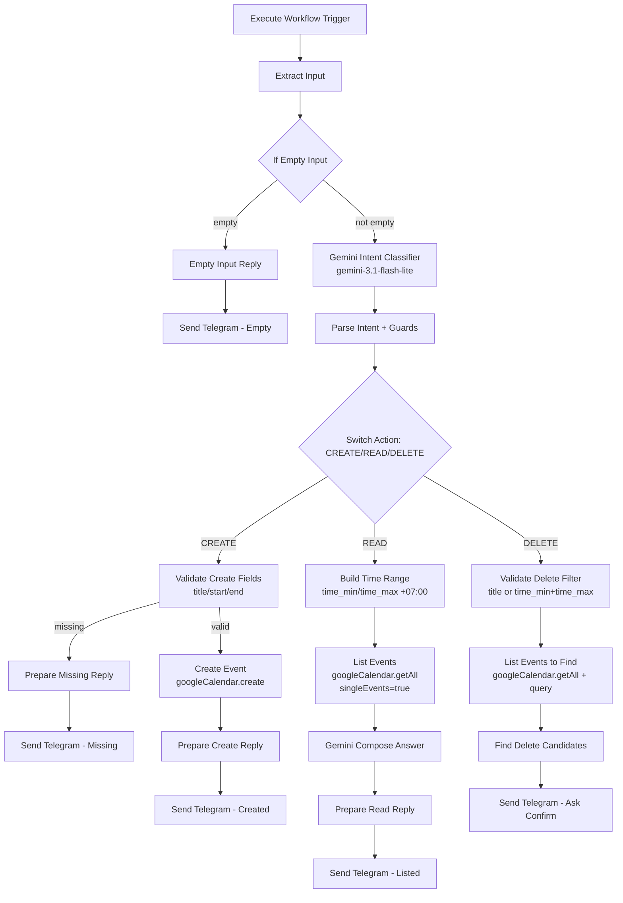

# Workflow 14: Calendar Assistant (Trợ lý tạo, xem, hủy lịch hẹn Google Calendar)

## 1. Tổng quan (Overview)
Sub-workflow `14_Calendar_Assistant` cho phép admin chat với Telegram bot bằng tiếng Việt tự nhiên để thao tác với Google Calendar `primary` của admin:

- **CREATE** — Tạo sự kiện mới (validate `title`, `start`, `end` theo ISO 8601 với timezone `+07:00`).
- **READ** — Liệt kê sự kiện trong khoảng thời gian (mặc định: tuần hiện tại).
- **DELETE** — Tìm và xóa sự kiện theo `title` + khoảng thời gian.

Workflow hoạt động như 1 **tool** trong `01_Telegram_AI_Agent` (LangChain AI Agent). AI Agent sẽ tự quyết định gọi tool này khi user nói về lịch hẹn, cuộc họp, sự kiện, reminder, "tuần này có gì", "mai có lịch gì", "hủy lịch X".

## 2. Trigger
- **Node**: `Execute Workflow Trigger` (`n8n-nodes-base.executeWorkflowTrigger`).
- Được gọi từ `01_Telegram_AI_Agent` qua `toolWorkflow` node với input:
  ```json
  {
    "user_message": "<câu chat của user>",
    "chat_id": "<Telegram chat_id>"
  }
  ```

## 3. Cấu trúc luồng xử lý (Data Flow)



## 4. Chi tiết các Node

### A. Extract Input
- **Loại**: Code (`n8n-nodes-base.code`, v2)
- **Chức năng**: Parse input từ AI Agent, đảm bảo `user_message` và `chat_id` tồn tại. Throw error nếu thiếu `user_message`. (Pattern y nguyên từ ST-013.)

### B. If Empty Input
- **Loại**: If (`n8n-nodes-base.if`, v2)
- **Chức năng**: Branch theo `is_empty_input`. Output 0 (true) → Empty Reply. Output 1 (false) → Intent Classifier.

### C. Empty Input Reply + Send Telegram (Empty)
- Gửi message hướng dẫn user nói rõ hơn (tạo/xem/hủy lịch).

### D. Gemini Intent Classifier
- **Loại**: HTTP Request gọi `gemini-3.1-flash-lite:generateContent`
- **Schema output** (8 field):
  ```json
  {
    "action": "CREATE|READ|DELETE",
    "title": "string",
    "start": "ISO 8601 +07:00 (cho CREATE)",
    "end": "ISO 8601 +07:00 (cho CREATE)",
    "description": "string (optional)",
    "location": "string (optional)",
    "time_min": "ISO 8601 +07:00 (cho READ/DELETE)",
    "time_max": "ISO 8601 +07:00 (cho READ/DELETE)"
  }
  ```
- **Prompt đặc biệt**: Yêu cầu Gemini luôn dùng múi giờ `Asia/Ho_Chi_Minh` (+07:00), "ngày mai" = hôm nay + 1, "tuần này" = T2-CN.
- **Fallback**: Nếu parse JSON fail → mặc định `action=READ`.

### E. Parse Intent + Guards
- **Loại**: Code
- **Chức năng**:
  - Parse `candidates[0].content.parts[0].text` thành JSON.
  - Validate `action ∈ {CREATE, READ, DELETE}` (default READ).
  - **Auto-add `+07:00`**: nếu Gemini output ISO thiếu timezone → tự thêm `+07:00` để an toàn.

### F. Switch Action
- **Loại**: Switch (`n8n-nodes-base.switch`, v3)
- 3 outputs theo `action` field với `renameOutput` = `create` / `read` / `delete`.
- `fallbackOutput: 'extra'` cho case lỗi.

### G. Nhánh CREATE (5 node)

#### G.1 Validate Create Fields
- Check `title`, `start`, `end` không rỗng.
- Validate `end > start` (parse ISO 8601).
- Nếu thiếu → return `{valid: false, missing: [...]}`. Nếu OK → return `{valid: true, ...}`.

#### G.2 Create Event
- **Loại**: `n8n-nodes-base.googleCalendar`, operation: `create`
- **Calendar**: `primary`
- **Start/End**: ISO 8601 với `+07:00`
- **Summary**: `title`
- **Description + Location**: từ intent (optional)

#### G.3 Prepare Create Reply
- Format Markdown tiếng Việt preview event với `fmtVN()` helper.

#### G.4 Prepare Missing Fields Reply
- Liệt kê field thiếu + ví dụ câu mẫu.

#### G.5 Send Telegram (CREATE Result / Missing Fields)
- 2 node Telegram riêng, gửi về `chat_id` với `parse_mode: Markdown`.

### H. Nhánh READ (5 node)

#### H.1 Build Time Range
- Defaults: `time_min` = đầu ngày hôm nay, `time_max` = hôm nay + 7 ngày.
- Đảm bảo có `+07:00`.

#### H.2 List Events
- **Loại**: `n8n-nodes-base.googleCalendar`, operation: `getAll`
- **Calendar**: `primary`
- **returnAll**: `true` (admin xem tuần có thể >50 event)
- **singleEvents**: `true` (expand recurring)
- **orderBy**: `startTime`
- **timeMin/timeMax**: từ intent

#### H.3 Gemini Compose Answer
- **Loại**: HTTP Request Gemini
- Model: `gemini-3.1-flash-lite` (free-form text, không schema)
- Prompt: cho data JSON + câu hỏi user → trả lời tiếng Việt ngắn gọn, format bảng Markdown, không bịa data.

#### H.4 Prepare Read Reply
- Lấy text từ Gemini response, kèm `chat_id`.

#### H.5 Send Telegram (READ Result)
- Telegram node gửi câu trả lời.

### I. Nhánh DELETE (4 node)

#### I.1 Validate Delete Filter
- Check có ít nhất 1 trong: `title` (non-empty) hoặc `time_min + time_max` (cả 2).
- Nếu thiếu → return `{valid: false, missing: [...]}`.

#### I.2 List Events to Find
- **Loại**: `n8n-nodes-base.googleCalendar`, operation: `getAll`
- **Calendar**: `primary`
- **query**: `title` (free text search trên Google)
- **singleEvents**: `true`
- **orderBy**: `startTime`

#### I.3 Find Delete Candidates
- **Loại**: Code
- **Logic**:
  - 0 event match → reply "Không tìm thấy".
  - 1 event match → auto-confirm (sẽ trả `auto_delete: true` cho future enhancement).
  - Nhiều event match → liệt kê 10 event đầu, hỏi user chọn.

> **Lưu ý (YAGNI - phase này)**: Workflow chưa có 2-step dialog (user reply "1" → delete). Phase này chỉ list + hỏi; user phải gõ lại yêu cầu DELETE cụ thể hơn (vd: "xóa lịch họp team lúc 10h") để AI Agent gọi lại tool.

#### I.4 Send Telegram (DELETE Ask)
- Telegram node gửi danh sách candidate hoặc thông báo không tìm thấy.

## 5. Credentials & Env

| Resource | ID/Name | Source |
|----------|---------|--------|
| `GEMINI_API_KEY` | env var | `.env.local` |
| Telegram credential | `temp-creds-tele` | n8n UI (đã có) |
| **Google Calendar OAuth2** | `google-calendar-oauth` | **CẦN TẠO MỚI** trong n8n UI |

### Setup Google Calendar OAuth2:
1. Mở n8n UI → Credentials → New
2. Tìm "Google Calendar OAuth2 API"
3. OAuth2 Redirect URL: copy từ n8n UI
4. Vào Google Cloud Console → APIs & Services → Credentials → Create OAuth 2.0 Client ID
5. Authorized redirect URIs: paste URL từ bước 3
6. Scope: `https://www.googleapis.com/auth/calendar.events` (full access)
7. Copy Client ID + Secret về n8n UI
8. Authorize với Google account admin
9. Đặt tên credential: `Google Calendar OAuth2` (sẽ match `id: 'google-calendar-oauth'` trong workflow JSON)

## 6. Cách Test

### A. Static test
```bash
npm run test:workflows
```
Kỳ vọng: 0 fail, pass count tăng 1 (từ 63 lên 64).

### B. CLI execute (kiểm tra import OK)
```bash
npm run n8n:import
npm run n8n:execute:all
```

### C. Manual test qua Telegram

**Test 1 - CREATE đủ field**:
- Gửi: "Đặt lịch họp team từ 10h đến 11h sáng mai, tại phòng họp A"
- Kỳ vọng: event xuất hiện trên Google Calendar primary, bot reply preview event với link.

**Test 2 - CREATE thiếu field**:
- Gửi: "Đặt lịch họp nhóm"
- Kỳ vọng: bot hỏi lại `title`, `start`, `end`, KHÔNG tạo event rác.

**Test 3 - READ**:
- Gửi: "Tuần này có những lịch hẹn nào?"
- Kỳ vọng: bot liệt kê event trong 7 ngày tới.

**Test 4 - READ filter**:
- Gửi: "Lịch họp team tháng này"
- Kỳ vọng: bot liệt kê event match "họp team".

**Test 5 - DELETE 1 match**:
- Gửi: "Hủy lịch họp team lúc 10h sáng mai"
- Kỳ vọng: nếu chỉ có 1 event match → bot confirm; nếu nhiều match → bot liệt kê + hỏi chọn.

**Test 6 - DELETE không tìm thấy**:
- Gửi: "Hủy lịch XYZ không tồn tại"
- Kỳ vọng: bot reply "Không tìm thấy sự kiện nào khớp".

## 7. Lưu ý & Giới hạn

- **Calendar ID**: hardcode `primary`. Phase 2 có thể tham số hóa từ intent.
- **Timezone**: mặc định `+07:00` (Vietnam). Gemini được prompt rõ trong intent.
- **End time mặc định**: nếu user chỉ nói "10h" mà không nói "đến 11h" → Gemini tự set `end = start + 1h` theo prompt.
- **Multi-step dialog** (xóa trong nhiều match): CHƯA hỗ trợ. User phải gõ lại yêu cầu cụ thể hơn. Phase 2 có thể thêm state machine với `getWorkflowStaticData`.
- **Conflict check**: KHÔNG có. Google Calendar UI sẽ cảnh báo overlap.
- **Recurring events (RRULE)**: KHÔNG hỗ trợ phase này.
- **Attendees/RSVP**: KHÔNG gửi invite.
- **OAuth2 setup**: cần user tự tạo credential trong n8n UI (không tự động).
- **Rate limit Gemini**: ~2-3s/turn, không lo quota với use-case admin chat.
- **Token cost**: ~600-800 tokens/turn (CREATE), ~500-700/turn (READ), ~700-900/turn (DELETE). Với Flash Lite pricing thì < $0.001/turn.

## 8. Mở rộng có thể (YAGNI - chưa làm)

- Multi-calendar (admin chọn calendar nào).
- OAuth per-user (multi-user).
- Recurring events (RRULE).
- Conflict check tự động.
- Update/Edit event.
- Attendees + RSVP.
- Free/Busy query.
- Multi-step dialog cho DELETE (state machine).
- Retry policy cho Gemini timeout.
- Tự động gửi Telegram reminder trước event.
