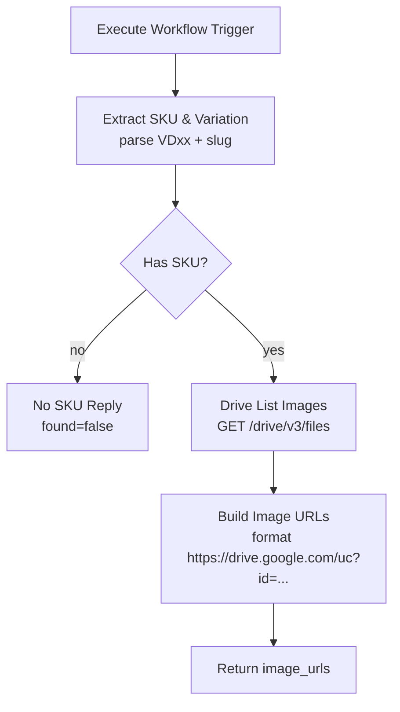

# Workflow 15: Product Image Lookup (Tra cứu ảnh sản phẩm từ Google Drive)

## 1. Tổng quan (Overview)
Sub-workflow `15_Product_Image_Lookup` tra cứu ảnh mẫu sản phẩm theo **SKU** (mã sản phẩm) từ 1 folder Google Drive đã cấu hình. Workflow này hoạt động như **1 tool** trong AI Agent của `02_Facebook_Gateway`.

Khi khách hàng bình luận trên Facebook fanpage hỏi về sản phẩm cụ thể (vd "Cho xem ảnh VD01 đen"), AI Agent tự gọi tool này để lấy URL ảnh, rồi reply comment **kèm ảnh đính kèm** (qua Meta Graph API `attachment_url`).

## 2. Trigger
- **Node**: `Execute Workflow Trigger` (`n8n-nodes-base.executeWorkflowTrigger`).
- Được gọi từ `02_Facebook_Gateway` qua `toolWorkflow` node với input:
  ```json
  {
    "user_message": "<câu chat/comment của khách>",
    "chat_id": "<senderId của khách>",
    "source": "comment" | "messenger"
  }
  ```

## 3. Cấu trúc luồng xử lý (Data Flow)



## 4. Chi tiết các Node

### A. Extract SKU & Variation
- **Loại**: Code (`n8n-nodes-base.code`, v2)
- **Chức năng**:
  - Parse SKU dạng `VD01`, `VD-28`, `vd 12` (case-insensitive) từ `user_message`.
  - Nếu có variation sau SKU (vd `VD01 den`, `VD-28 xanh`) → tách slug `den`, `xanh` (chỉ lấy 1 từ tiếng Việt không dấu 2-15 ký tự).
  - Trả về `{sku, variation, query_term, has_sku}`.
  - `query_term = "VD01"` (không variation) hoặc `"VD01-den"` (có variation).
- **KISS**: không dùng LLM, chỉ regex — chạy < 1ms, không tốn quota Gemini.

### B. Has SKU?
- **Loại**: If (`n8n-nodes-base.if`, v2)
- **Chức năng**: Branch theo `has_sku` boolean.
  - **false** → `No SKU Reply` (trả về `found=false`, không gọi Drive).
  - **true** → `Drive List Images`.

### C. Drive List Images
- **Loại**: HTTP Request (`n8n-nodes-base.httpRequest`, v4.1)
- **Endpoint**: `GET https://www.googleapis.com/drive/v3/files`
- **Query params**:
  - `q`: `name contains '{query_term}' and mimeType contains 'image/' and trashed = false and '{COMMENT_BOT_DRIVE_FOLDER_ID}' in parents`
  - `fields`: `files(id,name,mimeType,thumbnailLink,webContentLink)`
  - `pageSize`: 3
  - `orderBy`: name
- **Auth**: `Authorization: Bearer {GOOGLE_DRIVE_ACCESS_TOKEN}` (env)
- **Lý do dùng HTTP Request thay vì Google Drive node**: cần query string động linh hoạt (`name contains`) + parent folder filter, HTTP Request rõ ràng hơn cho debug.

### D. Build Image URLs
- **Loại**: Code (`n8n-nodes-base.code`, v2)
- **Chức năng**:
  - Lấy tối đa 3 file từ Drive response.
  - Format URL public: `https://drive.google.com/uc?id={fileId}&export=download` (theo gotcha đã note trong `n8n-workflow-patterns` Google Drive section).
  - Thêm `thumb` (thumbnail) và `webView` link dự phòng.
  - Trả về `{found, count, image_urls, primary_url}`.

### E. No SKU Reply
- **Loại**: Code (`n8n-nodes-base.code`, v2)
- **Chức năng**: Trả về `{found: false, count: 0, image_urls: [], reason: 'NO_SKU_DETECTED'}` để AI Agent biết gọi lại hỏi khách.

## 5. Credentials & Env

| Resource | ID/Name | Source |
|----------|---------|--------|
| `COMMENT_BOT_DRIVE_FOLDER_ID` | env var | `.env.local` |
| `GOOGLE_DRIVE_ACCESS_TOKEN` | env var | `.env.local` (OAuth2 token của service account hiện tại) |
| Tool: Product Image Lookup | (n8n tool node trong WF02) | workflows/02_Facebook_Gateway.json |

## 6. Cấu trúc Google Drive (admin tự setup)

```
CommentBotImages/                          ← COMMENT_BOT_DRIVE_FOLDER_ID
├── VD01-den/
│   ├── 01-front.jpg
│   ├── 02-back.jpg
│   └── 03-detail.jpg
├── VD01-trang/
│   └── 01-front.jpg
├── VD28/
│   ├── 01-front.jpg
│   └── 02-back.jpg
└── ...
```

**Quy tắc đặt tên**:
- Folder SKU = `VD{xx}` (uppercase) hoặc `VD{xx}-{slug}` nếu có variation.
- File = `0{1-N}-{view}.jpg` (vd `01-front.jpg`, `02-back.jpg`).
- Mỗi SKU 1 folder, tối đa 5 ảnh/folder.
- Folder cha phải share `Anyone with the link can view` để Meta Graph API tải được ảnh qua `attachment_url`.

## 7. Khi nào không dùng tool này
- Khách hỏi câu hỏi chung chung (vd "Có áo không?", "Giá bao nhiêu?") → AI Agent trả lời text-only, KHÔNG gọi tool.
- Khách cung cấp SĐT/địa chỉ (deal) → AI Agent lưu Sheets, KHÔNG gọi tool ảnh.
- Khách hỏi SKU không tồn tại trong Drive → tool trả `found=false`, AI Agent xin lỗi.

## 8. Out of scope (phase sau nếu cần)
- SKU > 50 → thêm Google Sheet `image_index` (sku, name, drive_url, tags).
- Resize ảnh trước khi gửi Meta (dùng `https://images.weserv.nl/`).
- Private reply (Meta `private_replies` API) thay vì public comment.
